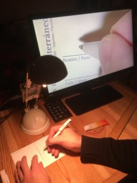

# magni
Software for a simple video magnifier running on Raspberry Pi



## Description
This project aims to build a video magnifier based on Raspberry Pi and its camera. It can be used to see printed text or images at a larger scale, or to identify small parts like SMD electronics. The device has to be connected to a monitor which will display the image from the camera at a specific magnification level. The user can step through predefined scale factors with a push-button or the Enter key, and switch to colour-inversion with a second push button or the "/" key.
After the initial setup, the device works fully offline and does not need an internet connection.


## Hardware
To build the magnifier, you need at least the following
* Raspberry Pi
  * any model will do
  * Raspberry Pi Zero is nice for its size, but needs specific cables/adapters for camera and USB
  * Raspberry Pi 4 needs specific cables/adapters and may need a heat-sink or fan
* Raspberry Pi camera
  * Strongly recommended is an official Raspberry Pi camera v2, due to better image quality and flexible focus
* Raspberry Pi camera cable
  * only if the standard 15cm cable is too short or you need the smaller cable for Raspberry Pi Zero
* Micro USB charger
* Micro SD card (>= 4GB)
* HDMI monitor + cable
* Material for the mount. Let your creativity flow, or follow these examples
  * [Lamp setup](docs/magni-lamp-mount.md) (basic and simple)
  * [Flexible arm](docs/magni-flexible-arm-mount.md) with one push-button
  * [Box setup](docs/magni-box-mount.md) with 2 push-buttons

A slightly more in-depth description of the first 2 hardware setups is given at http://www.fhack.org/2018/12/19/raspberry-pi-video-magnifier-2018/

If you use the optional push buttons instead of a numerical keyboard, the script expects them at GPIO 4 (physical 7) for the scale button and GPIO 18 (physical 12) for the colour-invert button, using BCM numbering (4 being the 4th pin on the left, 18 being the 6th pin on the right of the GPIO). Each button needs to be connected with GND, e.g. at pins 9 and 14.

## Setup
* Download [Raspberry Pi OS Lite](https://www.raspberrypi.org/software/operating-systems/) and install on SD card
* Connect camera
* Login with default user “pi”, password “raspberry” (if on desktop, open a terminal)
* Run `sudo raspi-config`
  * System options -> Boot / Autologin -> Console Autologin
  * System options -> Network at boot -> No (speeds up booting)
  * Interface options -> Camera -> Enable
  * System options -> Wireless LAN (if you want to connect from another computer by wifi)
  * Interface options -> SSH -> Enable (only if you want to connect from another computer)
  * Finish and reboot (<Yes> or `sudo reboot`)
* After reboot, adapt the camera focus to your setup: `raspivid -f -rot 180 -t 0`
  * If you see the current camera view, and it's at the same angle that you have from above (e.g. it’s not upside down), you’re good, otherwise try different values for rot (0, 90, 180, 270) and adapt them later in magni.py
  * If the image is blurry you should adjust the focus, simply turning the lens with the plastic “wheel” that comes with the Pi camera v2
  * Use Ctrl-c to get out of the camera view
* Run the following commands in the terminal:
```
sudo apt -y update
sudo apt -y upgrade
sudo apt install -y python3-picamera python3-gpiozero python3-evdev
wget https://github.com/ctrlw/magni/raw/master/magni.py
chmod +x magni.py
echo "clear" >> .bashrc
echo "./magni.py" >> .bashrc
```
* To have a lower-quality fallback when the monitor / TV is switched on *after* the magnifier, edit /boot/config.txt:
 `sudo nano /boot/config.txt`
  * Move to the line "#hdmi_force_hotplug=1" and delete the first character (#)
  * Leave nano with Ctrl-x, press “y” to save and enter to update the given file

* To hide the messages during startup, edit /boot/cmdline.txt:
`sudo nano /boot/cmdline.txt`
  * Append the following at the end of the line and save the file:
` logo.nologo quiet splash`
  * Leave nano with Ctrl-x, press “y” to save and enter to update the given file

### Support hard shut-down
This step allows to simply unplug the Raspberry Pi without possible damage to the SD card. This should be the last step, as the system will be made read-only (but it can be undone if needed).
This feature is now supported out of the box on Raspberry Pi OS, so no extra script is needed anymore.

Run `sudo raspi-config`
* Performance options -> Overlay File System
  * Enable overlay file system: Yes
  * Write-protect boot partition: Yes
  * Reboot? Yes

Now you can still create and modify files locally, but they will not be written to the SD card and disappear on the next reboot.
If you want to make the system writable again, you can do it in 2 steps with raspi-config:
* Disable the Overlay File System, so you can write to the file-system
* If you also want to modify the boot partition, you have to do it in a second step after rebooting

## Camera focus
When everything is in place, adjust the focus till a letter under the camera looks sharp. Then try a book and maybe adjust. Not all objects are flat. If you’re smart you got a Raspberry Pi camera v2 and do it the easy way, just turning the white ring tool. On the older camera model or cheap alternatives, the lens may be glued and can still be adapted, but you risk breaking the camera.


## Modifications
You can easily adapt magni.py to your own setup and needs:
* `DISTANCE_TO_SURFACE_CM`: Distance between the camera lens and the surface, adapt it to your setup
* `WIDTHS_CM`: Defines the approximate widths you can iterate through with the scale button. You can change the values, e.g. to the column widths of expected reading material, add more values or remove some
* `SCALE_FACTORS`: Uncomment and modify this line if you rather want to specify scale factors directly instead of line widths
* `PIN_NUMBER_SCALE`: Set the (BCM) GPIO pin number where you connect the optional scale push-button
* `PIN_NUMBER_COLOR`: Set the (BCM) GPIO pin number where you connect the optional colour-mode push-button
* `ROTATION`: Change the value to the camera rotation in your setup if the camera is not placed behind the object (supports 0, 90, 180 and 270)

## Limitations
* Magnification is done in software, so scale factors above 10 tend to be noisy (with Raspberry Pi camera v2)
* The camera focus is fixed, so it cannot adapt to objects that are much closer or further away
* It may take a minute from power on till the picture is shown (depending on model and SD card)
