# magni
[](https://www.buymeacoffee.com/ctrlw)

Software for a simple video magnifier running on Raspberry Pi. The first video demonstrates magnification and colour inversion, the second reading out text.

[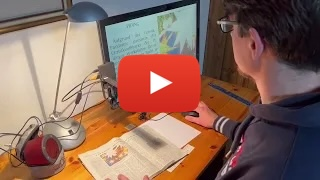](https://youtu.be/32cXs6KolWk "DIY video magnifier demo scaling text and inverting colours")
[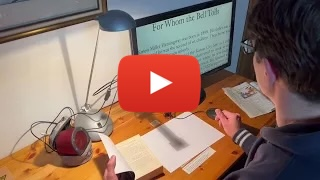](https://youtu.be/zVkWfopQ86A "DIY video magnifier reading out text from a book")


## Description
This project aims to build a video magnifier based on Raspberry Pi and its camera. It can be used to see printed text or images at a larger scale, or to identify small parts like SMD electronics. The device has to be connected to a monitor which displays the magnified image from the camera. The user can step through predefined scale factors with a button or the Enter key, and step through different colour modes (like colour-inversion) with a second button or the "/" key. There's also basic support for reading out text (supports English, Spanish, French, German or Italian).

After the initial setup, the device works fully offline and does not need an internet connection.

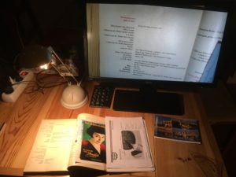

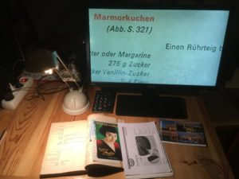

## Usage
The device boots directly into (slightly magnified) fullscreen camera view, which can take a minute depending on the Raspberry Pi model and SD card. It's important that the monitor is powered on at the same time as the Raspberry Pi or before, otherwise we may not get the full resolution. This can be achieved e.g. using a switchable socket or powering the Raspberry Pi directly from the monitor. 

The script supports multiple input sources:
* Mouse
  * Left button: switch to next magnification level (from smaller to bigger, then jump back to first)
  * Right button: switch between regular view and colour inversion / colour modes
  * Middle button: read out the text on the screen, stop it if already processing
  * Movement: no impact, the mouse is only used for its buttons. The recommendation is to prevent the mouse from accidental slipping, e.g. by sticking rubber bumpers on the bottom
* Keyboard (also supports a small numeric keyboard for the main features)
  * Enter: switch to next magnification level
  * /: switch between regular view and colour inversion / colour modes
  * r: read out the text on the screen, stop it if already processing
  * z: zoom in
  * Z: zoom out
  * a: autofocus (only with v3 camera, also happens automatically on each magnification change)
  * f: focus a bit closer
  * F: focus a bit further away
  * b: increase brightness
  * B: reduce brightness
  * c: increase contrast
  * C: reduce contrast
  * h: increase sharpness
  * H: reduce sharpness
  * t: increase saturation
  * T: reduce saturation
  * s: save the current preview as an image, name is the current timestamp
  * 1-0: set magnification level to specific value between 1 and 10
  * Esc or q: quit
* Push buttons via GPIO, one to iterate to the next scaling factor and one to switch between colour inversion / colour modes

## Hardware
To build the magnifier, you need at least the following
* Raspberry Pi
  * Any model you have will do (except Pi Pico), but if you're going to buy one I'd recommend the Pi 3 or Zero 2 W
  * Raspberry Pi Zeros are nice for their size, but need specific cables/adapters for camera and USB
  * Raspberry Pi 4 and 5 need specific cables/adapters and may also need cooling. They are overkill for the magnification task but could be faster for Text-To-Speech (reading out content)
* Raspberry Pi camera
  * Strongly recommended is an official Raspberry Pi camera v2 or v3, due to better image quality and flexible focus compared to the original 5MP ones. The v3 has autofocus which can be handy when supporting different distances to surface (e.g. when mounted on a flexible arm). However, the autofocus is not always accurate, so a v2 camera that is tuned to the right distance can be the better choice if you have a fixed distance to the surface. The high quality camera with additional lenses is not needed. The v3 version with Wide angle could be useful for close distances but has aberrations in the corners, so the regular v3 is probably the better choice.
* Raspberry Pi camera cable
  * only if the standard 15cm cable is too short or you need the smaller cable for Raspberry Pi Zero
* USB charger. For higher specced Raspberry Pi models (3 upwards) the official chargers are recommended due to better power stability
* Micro SD card (>= 4GB)
* HDMI monitor + cable. Some Raspberry Pi models work with analog TVs as well, but this hasn't been tested. A 22-24" FullHD monitor is good and can be found for 100
* Some input device. The easiest way is a USB (cable) mouse just for the buttons, but a numerical keyboard is also possible, or you can even solder physical push buttons to the GPIO
* Material for the mount

## Mount
The setup can be built in different ways, so let your creativity flow. Here are some examples:
* [Lamp setup](docs/magni-lamp-mount.md) (basic and simple)
* [Flexible arm](docs/magni-flexible-arm-mount.md) with one push-button
* [Box setup](docs/magni-box-mount.md) with 2 push-buttons
* [3d print for Pi Zero](docs/magni-3d-zero.md)

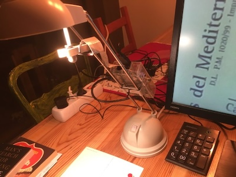
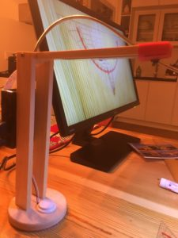
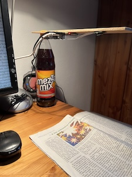
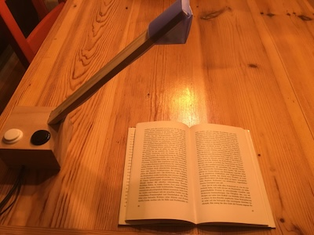
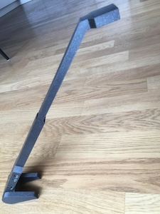
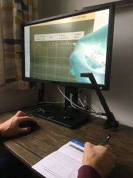
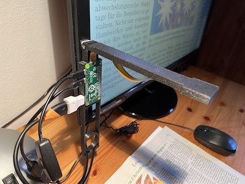

A slightly more in-depth description of the first 2 hardware setups is given at http://www.fhack.org/2018/12/19/raspberry-pi-video-magnifier-2018/

If you use the optional push buttons instead of a USB mouse or numerical keyboard, the script expects them at GPIO 4 (physical 7) for the scale button and GPIO 18 (physical 12) for the colour button, using BCM numbering (4 being the 4th pin on the left, 18 being the 6th pin on the right of the GPIO). Each button needs to be connected with GND, e.g. at pins 9 and 14.
While physical buttons are nice, this involves soldering and they may be susceptible to electro-magnetic noise (e.g. getting triggered from switching some device on/off, or even from static charges from my Ikea Markus chair).

## Setup
**2021's Raspberry Pi OS "Bullseye" introduced some incompatible changes for the camera module. The following steps assume you use the latest OS, but the older "Bullseye" OS is still available as "Legacy OS" and allows to set the camera as Legacy camera in raspi-config (Interface options -> (Legacy) Camera -> Enable). The python script should work with both but the setup for legacy camera support is slightly different and can be found below.**
* Download [Raspberry Pi OS **Lite**](https://www.raspberrypi.org/software/operating-systems/) and install on SD card, e.g. with Raspberry Pi Imager. The 32 bit version is usually fine
* [Connect camera](https://www.raspberrypi.com/documentation/accessories/camera.html#connecting-the-camera)
* Login with default user “pi”, password “raspberry” (if on desktop, open a terminal). Using the default credentials is not secure, so change it if you will connect the device to the internet or have it accessible to strangers
* Run `sudo raspi-config`
  * System options -> Boot / Autologin -> Console Autologin
  * System options -> Wireless LAN (if you want to connect from another computer by wifi)
  * Interface options -> SSH -> Enable (only if you want to connect from another computer)
  * Finish and reboot (<Yes> or `sudo reboot`)
* Run the following commands in the terminal:
```
sudo apt update && sudo apt -y upgrade
sudo apt install -y python3-picamera2 python3-gpiozero python3-evdev python3-opencv
wget https://github.com/ctrlw/magni/raw/master/magni.py
chmod +x magni.py
echo "clear" >> .bashrc
echo "./magni.py" >> .bashrc
```
* To have a lower-quality fallback in case the monitor / TV is switched on *after* the magnifier, edit /boot/config.txt:
 `sudo nano /boot/config.txt`. This doesn't seem supported in the latest OS anymore.
  * Move to the line `#hdmi_force_hotplug=1` and delete the first character (#)
  * Leave nano with Ctrl-x, press “y” to save and enter to update the given file

* To hide the messages during startup, edit /boot/cmdline.txt:
`sudo nano /boot/cmdline.txt`
  * Append the following at the end of the line and save the file:
` logo.nologo quiet splash`
  * Leave nano with Ctrl-x, press “y” to save and enter to update the given file

### Legacy OS
The setup is the same as above with the following exceptions:
* In `sudo raspi-config` also enable Legacy camera support: Interface options -> Legacy Camera -> Yes
* When installing python libraries with apt, install `python3-picamera` instead of `python3-picamera2`, and you can skip `python3-opencv` as colour inversion is supported out of the box but not the colour modes
* For Readout (see below) use `bullseye` instead of `bookworm`. However, the area being read differs from the visible preview.
* You can use `libcamera-still` and `raspistill` instead of `libcamera-hello`

If you enable Legacy camera support, v3 cameras are not supported (at all, not just the autofocus!). The main advantage with legacy camera is the faster colour inversion, which can be otherwise slow on older models like the original Pi Zero or the Raspberry Pi models before the Pi 3. However, other colour modes like yellow on blue are only supported with the newer OS and needs opencv installed.

### Support reading out the visible text (OCR + TTS)
This feature is a very basic approach to read out text that is visible on the screen. It gets triggered when pressing the middle button of the mouse or "r" on an attached keyboard. Pressing the key again while it's still processing stops the background process.

All processing happens on the device itself (no internet needed), so better Raspberry Pi models will compute results faster. This feature is very sensitive to image quality and correct alignment, so ensuring good light, clear focus and horizontal text is necessary for reasonable results.

To make this work there are some extra dependencies. For Text to speech (TTS) we use pico2wave which is not included in the Raspberry Pi OS sources, so we have to add upstream Debian sources.
```
echo "deb [arch=armhf, trusted=yes] http://deb.debian.org/debian bookworm main contrib non-free" | sudo tee -a /etc/apt/sources.list
sudo apt update && sudo apt install -y tesseract-ocr libttspico-utils
wget https://github.com/ctrlw/magni/raw/master/plop.wav
```
The current OS (in late 2023) is based on bookworm. If you're on a different version you may have to adapt the first line accordingly, e.g. replace `bookworm` with `bullseye` if you're on the Legacy OS.

For other languages than English you need to install the related language packs. The used TTS package only supports 6 voices (en-GB, en-US, de-DE, es-ES, fr-FR, it-IT), so you can install all necessary OCR languages with
```
sudo apt install -y tesseract-ocr-deu tesseract-ocr-spa tesseract-ocr-fra tesseract-ocr-ita
```
and then update the language in magni.py, e.g.:
```
OCR_LANG = 'deu'   # Tesseract's character recognition: eng, deu, spa, fra, ita
TTS_LANG = 'de-DE' # Pico's Text to Speech: en-GB, en-US, de-DE, es-ES, fr-FR, it-IT
```

Sound may come through HDMI if you have a screen with speakers, or through the headphone jack of some models like the Pi 3. This can be changed in `sudo raspi-config` under System options -> Audio -> Headphones / HDMI. You can test that sound works running the built-in `speaker-test`.
There seems to be an issue where [audio via HDMI doesn't work as expected](https://forums.raspberrypi.com/viewtopic.php?t=351718). As a workaround you can force `aplay` to use HDMI output by uncommenting the second AUDIO line in the script to show `AUDIO = 'aplay -D sysdefault:CARD=vc4hdmi'` (if `speaker-test -D sysdefault:CARD=vc4hdmi` works).

### Support hard shut-down
This step allows to simply unplug the Raspberry Pi without possible damage to the SD card. This should be the last step in the setup, as the system will be made read-only (but it can be undone if needed).

Run `sudo raspi-config`
* Performance options -> Overlay File System
  * Enable overlay file system: Yes
  * Write-protect boot partition: Yes
  * Reboot? Yes

Now you can still create and modify files locally, but they will not be written to the SD card and disappear on the next reboot.
If you want to make the system writable again, you can do it in 2 steps with raspi-config:
* Disable the Overlay File System, so you can write to the file-system
* If you also want to modify the boot partition, you have to do it in a second step after rebooting

## Camera focus
**If you use the camera v3 with its autofocus you can skip this step as it doesn't need manual setup.**

When everything is in place, adjust the focus till a letter under the camera looks sharp. Then try a book and maybe adjust. Not all objects are flat. The  Raspberry Pi camera v2 usually comes with a white ring tool to easily adjust focus. On the older camera model or cheap alternatives, the lens may be glued and can still be adapted, but you risk breaking the camera.

You can do this with the magni.py script, or run `libcamera-hello --rotation 180 -t 0`:
* If you see the current camera view and it's at the same angle that you have from above (e.g. it’s not upside down), you’re good, otherwise try different values for rotation (0, 180) and adapt the ROTATION value in magni.py accordingly
* If the image is blurry you should adjust the focus, simply turning the lens with the plastic “wheel” that comes with the Pi camera v2
* Use Ctrl-c to get out of libcamera-hello (or Esc to leave the magni script)


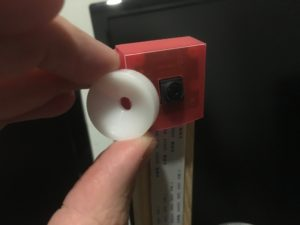

## Modifications
You can easily adapt magni.py to your own setup and needs:
* `SCALE_FACTORS`: Modify this line to specify the scale factors
* `PIN_NUMBER_SCALE`: Set the (BCM) GPIO pin number where you connect the optional scale push-button
* `PIN_NUMBER_COLOR`: Set the (BCM) GPIO pin number where you connect the optional colour-mode push-button
* `ROTATION`: Change the value to the camera rotation in your setup if the camera is not placed behind the object (supports 0, 180; picamera on legacy OS also allowed 90 and 270 but this isn't the case on newer OS versions)
* `MID_BUTTON_READOUT`: Defines what happens when pressing the middle button of a mouse. `True` reads out the text in the preview, `False` saves the preview as an image (name is the current timestamp)
* `DISTANCE_TO_SURFACE_CM`: Can be overridden for v3 camera to fix the focus at a specific distance, default is autofocus
* `AUDIO`: Can be modified to force audio via HDMI if `raspi-config` isn't enough, just uncomment the respective line
* `BRIGHTNESS`: Can be modified to start with different brightness, values between -1.0 and 1.0
* `CONTRAST`: Can be modified to start with different contrast, values between 0.0 and 32.0
* `SHARPNESS`: Can be modified to start with different sharpness, values between 0.0 and 16.0
* `SATURATION`: Can be modified to start with different saturation, values between 0.0 and 32.0
* `COLOR_MODES`: Can be modified to change the list of supported colour modes to step through

## Limitations
* The monitor has to be switched on before or at the same time as the Raspberry Pi
* Magnification is done in software, so scale factors of 10 and above tend to be noisy
* On older cameras the camera focus is fixed, so it cannot adapt to objects that are much closer or further away. Pi camera v3 supports autofocus but it's often not that accurate
* It may take a minute from power on till the picture is shown (depending on model and SD card)
* The readout feature is very basic and mostly a proof of concept

## Alternatives
This is a fun project, but also consider these alternatives to building your own video magnifier
* Smartphones and tablets usually come with a magnification option, e.g. the built-in [Magnifier on iOS](https://support.apple.com/en-us/HT209517) and [Google's Magnifier on Android](https://play.google.com/store/apps/details?id=com.google.android.apps.accessibility.magnifier)
* A mounted magnifying glass as they are used in nail salons
* Professional video magnifiers are optimised for low vision users with varying needs and conditions. While they cost in the thousands, it's often possible to find them much cheaper used, e.g. on Ebay. Depending on your location, health insurance providers or organisations for the Blind may also have special offers or even provide support for free
* Others have come up with similar DIY solutions which may be better suited, e.g.
  * [Precision zoom on Raspberry Pi](https://www.instructables.com/Raspberry-Pi-Zero-HDMIWiFi-Soldering-Microscope/)
  * [Borescope camera and laptop](https://www.instructables.com/Reading-Aid-for-the-Partially-Sighted/)
  * [USB camera and laptop](https://github.com/mikeh69/EVidMag)