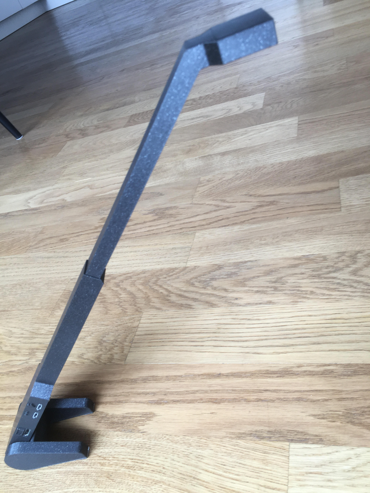

# Small 3d printed video magnifier
Simple and compact 3d-printed setup that is good enough for books and also works for the occasional letter. For Raspberry Pi Zero with 30cm ribbon cable. Uses mouse buttons for input.

## Ingredients
* HDMI monitor (22-24 inch is a good size)
* Raspberry Pi Zero
* Raspberry Pi Camera v2
* 30cm camera ribbon cable for Raspberry Pi Zero
* USB Mouse (as input device)
* Micro USB to USB adapter (for the mouse)
* 8 screws (2mm diameter, 10mm length)
* 1 M16 connecting nut (16mm screw diameter, 24mm outer diameter, 50mm length) as weight
* HDMI cable with one side mini HDMI, other normal size HDMI
* Micro USB charger
* (optional) rubber stickers to stick under the mouse, to avoid it moving (as we only use the buttons)

## 3d printed parts
Print the following parts on a 3d printer (tested with PLA on a Prusa Mini):
* [Body](../stl/zero-wide-body7.stl)
* [Cover for body](../stl/zero-wide-bottom7.stl)
* [Camera arm](../stl/zero-wide-arm3.stl)
* [Cover for arm](../stl/zero-wide-arm3-inner.stl)
* [Foot](../stl/zero-wide-foot7.stl)
* [Other Foot (same file, but you have to flip it before printing)](../stl/zero-wide-foot7.stl)

## Building
* Attach camera cable to camera, pass the cable through the camera arm and screw the cover onto the camera
* Stick camera arm into body
* Attach other end of the camera cable to Raspberry Pi
* Screw the body cover onto Raspberry Pi
* Insert M16 nut into the cavity at the end of the body
* Stick feet on both sides of the M16 nut so the device is at a 45 degrees angle
* Connect HDMI cable to the monitor
* Connect mouse and micro USB adapter to the center micro USB port
* Connect micro USB charger to the other micro USB port

## Usage
One mouse button iterates through the pre-defined magnification factors, the other switches between normal and inverted colour mode.
Smaller items like books can be moved under the device. For bigger items like newspapers the device has to be moved on top of the paper which is less convenient. 
