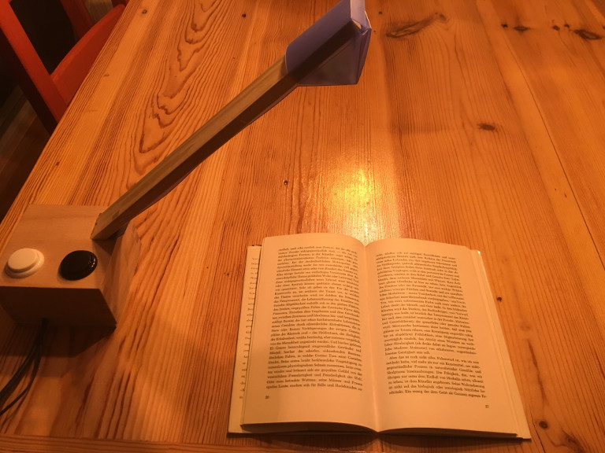

# Box mount video magnifier
This setup uses a square box with a diagonal camera arm. Box and arm can be laser-cut, while you may want to 3d-print the camera enclosure or build it from plastic. If you position the magnifier on the side and not behind the object, you also have to adapt the ROTATION in the magni.py script. Image quality is worse when positioned sideways (with rotation 90 or 270).

This is more of a prototype that someone might want to expand on.

## Ingredients
* 2 Push-buttons (3cm diameter) and cables (like this [arcade set](https://www.amazon.de/dp/B06XDG6PC1))
* Wood glue
* ~A3 sized ply wood (4mm thick, laser-cuttable)
* Access to a laser-cutter
* LED lamp (optional, not shown here)

## Building
Cut the wood according to this [SVG for laser-cutter box](box-magni-laser-4mm.svg). Red lines should be cut, green just marked and blue can be carved for cables to add an LED light. The design hasn't taken into account that laser cuts also have a width, so the parts will not be stable just by combining them, but the wood needs to be glued.
For illustration purpose here's an older [pdf for laser-cutter box](box-magni-laser-a4.pdf), which does not contain the camera arm and may not be adapted to 4mm wood.

## Usage
One push-button steps through magnification levels, the other toggles colour inversion.