# Flexible arm magnifier
This design is more (wood-) work. The arm is flexible, so the device can be folded for transport. The single button makes it easy to use, and you can move the arm up and down to see more / less (e.g. slightly move upwards for a big newspaper). Sizes can be adapted for its typical use case, e.g. for regular newspaper reading a bigger stand may be needed. 

## Ingredients
* Raspberry Pi case with holes for GPIO cables
* USB LED lamp
* Wood (3cm x 1cm, 2 * 25cm, 1 * 20cm)
* Wooden wheel (10cm diameter, 1.5cm thick or more)
* Screws (4 * 2 cm to fix arm and Raspberry Pi, 2 * 4cm to fix bottom)
* Flex band 30cm for Raspberry Pi camera (or 50 cm if you make it bigger)
* Plastic to fold the camera case
* 2 jumper cables, 1 resistor (used 1k Ohm)
* 1 push button (3cm, taken from arcade joystick set)
* Rubber to keep it in place and protect push button electronics
* Tools: saw (Japan saws are great!), 2-3mm drill for pre-drilling the screws, 3cm drill for drilling the button hole, screwdriver, soldering equipment, cardboard cutter, glue

## Build
Below is a kind of step-by-step photo story. The screws for the case are about 15cm above the top of the base.

The jumper cables are attached to GPIO 7 and 9, i.e. the 4th pin on the left side and the neighbouring GND. I had to bend the push button connectors and break off one of its plastic pieces. Also cut one side of the jumper cables to solder to the button / resistor.

For the push-button I mostly followed https://raspberrypihq.com/use-a-push-button-with-raspberry-pi-gpio, and avoiding multiple click events with bounce time was a helpful addition from https://www.raspberrypi.org/forums/viewtopic.php?t=146369

The “case” for the camera is cut and glued from plastic and about 3cm x 3cm, with a height of 1.3cm, basically the wood plus about 3mm. The camera lens watches through an 8mm square. You can also 3d-print the [camera case STL](./magnicam.stl)

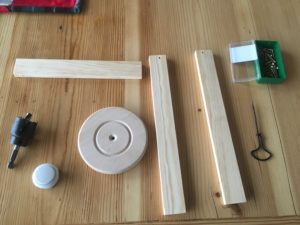
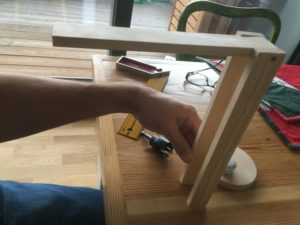
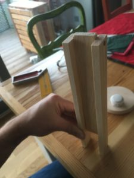
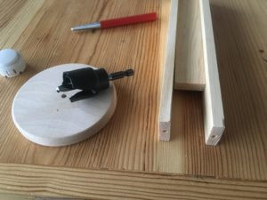
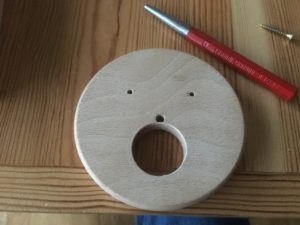
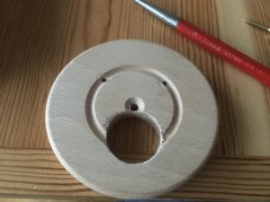
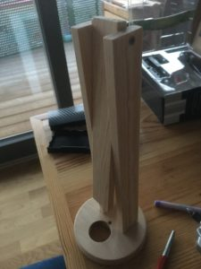
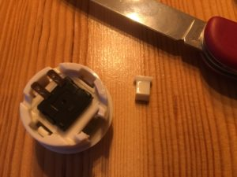
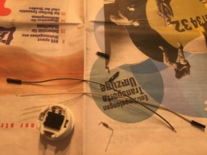
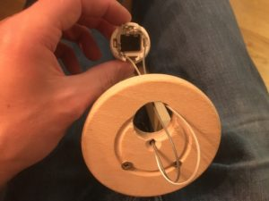
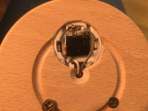
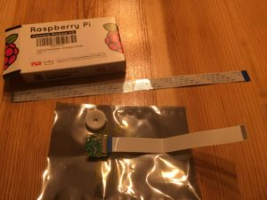
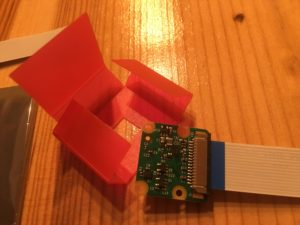
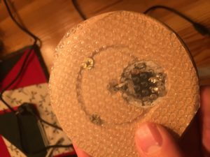
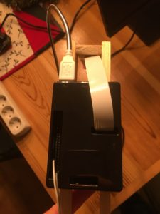
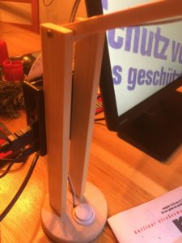
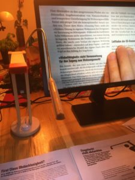
