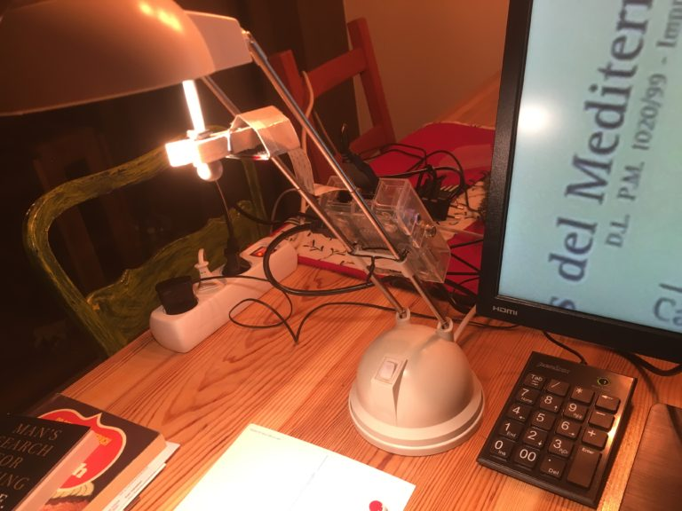
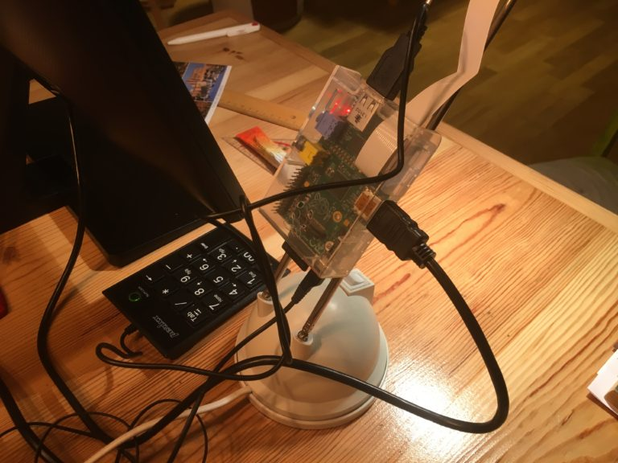

# Lamp mount video magnifier
This is the most basic setup. 

## Ingredients
* Raspberry Pi case (had a Raspberry Pi 1 with official case)
* Lamp (had a basic halogen lamp from the hardware store)
* Numeric keypad
* Wooden peg with a bit of rubber gum inside
* Twist tie (to attach the case to the lamp)
* Cardboard to “protect” the camera

## Building
There’s really nothing to it. Very simple to “build”. Not exactly stable.

## Usage
Pressing a digit on the numeric keypad switches magnification to that factor (except for too small values, i.e. "1" normally does nothing). Pressing the Enter key switches to next preset magnification level. Pressing “/” inverts colours (some people are better reading white text on black background). This is not exclusive to this build, of course the keypad can also be attached to other versions.